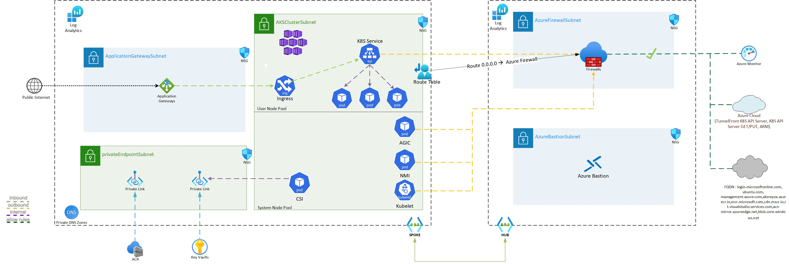

# AKS Secure Baseline with Private Cluster
There are various ways to secure your AKS cluster. From a network security perspective, these can be classified into securing the control plane and securing the workload. When it comes to securing the controle plane, one of the best ways to do that is by using a private cluster, where the control plane or API server has internal IP addresses that are defined in the [RFC1918 - Address Allocation for Private Internet](https://datatracker.ietf.org/doc/html/rfc1918) document. By using a private cluster, you can ensure network traffic between your API server and your node pools remains on the private network only. For more details about private clusters, check out the [documentation](https://docs.microsoft.com/azure/aks/private-clusters). 

When using a private cluster, the control plane can only be accessed from computers in the private network or peered networks. For this reason, in this reference implementation, we will be deploying a virtual machine in the Hub network through which we can connect to the control plane.

By the end of this, you would have deployed a secure AKS cluster, complient with Enterprise-Scale for AKS guidance and best practices. We will also be deploying a workload known as the Ratings app that is also featured in the [Azure Kubernetes Services Workshop](https://docs.microsoft.com/en-us/learn/modules/aks-workshop/). Check out the workshop for some intermediate level training on AKS.

For this scenario, we have various IaC technology that you can choose from depending on your preference. At this time only the ARM version is available. Below is an architectural diagram of this scenario.

## Core architecture components
* AKS
* Azure Virtual Networks (hub-spoke)
  * Azure Firewall managed egress
* Azure Application Gateway (WAF)
* Application Gateway Ingress Controller
* AKS-managed Internal Load Balancer
* Azure CNI
* Azure Keyvault
* Azure Container registry
* Azure Bastion
* Azure Monitor for containers
* Azure firewall
* MongoDB 
* Helm
* [Secret store CSI driver](https://docs.microsoft.com/azure/aks/csi-secrets-store-driver)
* [Azure RBAC for Kubernetes Authorization](https://docs.microsoft.com/azure/aks/manage-azure-rbac)
* [Azure Active Directory pod-managed identities](https://docs.microsoft.com/azure/aks/use-azure-ad-pod-identity)

## A future workload for this scenario will include the following 
* Horizontal Pod Autoscaling
* Cluster Autoscaling
* Readiness/Liveness Probes
* Azure Service Bus
* Azure CosmosDb
* Azure MongoDb
* Azure Redis Cache

## Steps of Implementation for AKS Construction Set

A deployment of AKS-hosted workloads typically experiences a separation of duties and lifecycle management in the area of prerequisites, the host network, the cluster infrastructure, and finally the workload itself. This reference implementation is similar. Also, be aware our primary purpose is to illustrate the topology and decisions of a baseline cluster. We feel a "step-by-step" flow will help you learn the pieces of the solution and give you insight into the relationship between them. Ultimately, lifecycle/SDLC management of your cluster and its dependencies will depend on your situation (team roles, organizational standards, etc), and will be implemented as appropriate for your needs.

## Next
Pick one of the IaC options below and follow the instructions to deploy the AKS reference implementation.

:arrow_forward: [ARM](./ARM)

:arrow_forward: [Terraform (coming soon)](./Terraform)

:arrow_forward: [Bicep (coming soon)](./Bicep)
